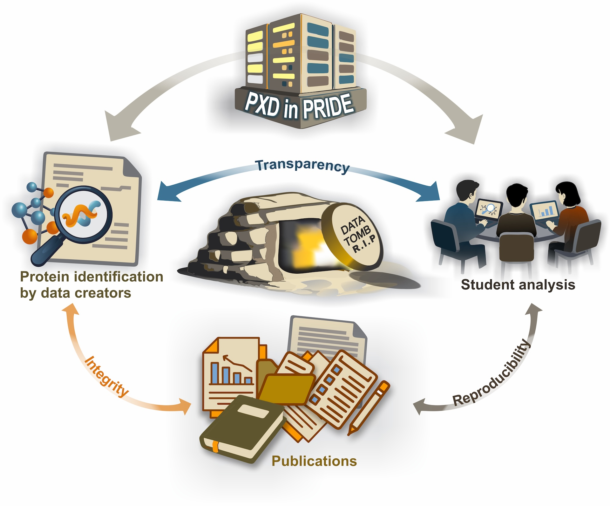

## Pre-Class Preparation

📄 Please read the assigned article before the session:

🔗 https://www.nature.com/articles/s41597-026-06614-8

{width="80%"}

------------------------------------------------------------------------

## Activity Overview

-   Interactive, discussion-based session\
-   Goal: deepen understanding through questioning\
-   Build answers collaboratively across groups

------------------------------------------------------------------------

## Activity Structure

-   Work in groups of 3-4\
-   Total activity time: \~30 minutes\
-   Focus: critical thinking and collaboration

------------------------------------------------------------------------

## Activity Flow (Illustration)

Each group (A–E) follows the same process independently, with question rotation between groups at each step.

| Step | Time | Task |
|---------|--------------|------------------------------------------------------|
| 1 | 5 min | Creates a question |
| 2 | 5 min | Exchange questions and answer them |
| 3 | 5 min | Pass to a new group |
| 4 | 5 min | Final group reviews |
| 5 | 2 min | Present the question and final answer |

------------------------------------------------------------------------

## Let’s Begin 🚀

**Rotation principle:**\
Each group starts with its own question and receives a different question at each step, ensuring all groups both create and evaluate ideas.

------------------------------------------------------------------------

## Step 1: Create a Question (5 min)

-   Discuss the article in your group\
-   Identify key concepts or unclear points\
-   Write **one meaningful question**\
-   Avoid simple factual questions

------------------------------------------------------------------------

## Step 2: First Exchange (5 min)

-   Pass your question to another group\
-   Read carefully\
-   Start drafting an answer

------------------------------------------------------------------------

## Step 3: Second Exchange (5 min)

-   Pass to a new group\
-   Review the previous answer\
-   Improve, refine, or challenge it

------------------------------------------------------------------------

## Step 4: Finalize (5 min)

Review all inputs\

-   There may not always be one correct answer\
-   If a clear answer exists, present it\
-   If not:
    -   Provide your best reasoning\
    -   Explain your interpretation

## Step 5: Presentations (10 min total)

-   Each group presents:
    -   The question\
    -   Final answer or discussion
-   ⏱ Time per group: **2 minutes**\
-   👥 Total groups: **5**

------------------------------------------------------------------------

## Thank You!

🙏 Thank you for your participation  

Questions or comments?