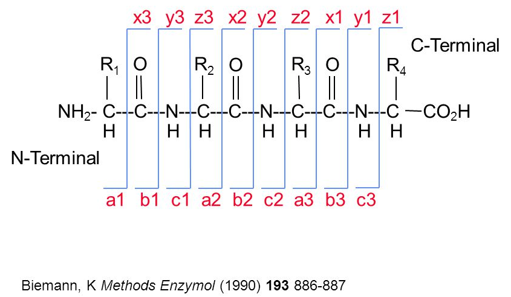

### Quiz 1 (IA_4)
Visit `gosocrative.com` and enter room name `FIN2026`

## Library
```{r, message=FALSE, warning=FALSE}
# if (!require("BiocManager", quietly = TRUE))
#     install.packages("BiocManager")
# 
# BiocManager::install("PSMatch")
# if (!requireNamespace("remotes", quietly = TRUE))
#     install.packages("remotes")
# 
# remotes::install_github("RforMassSpectrometry/SpectraVis")

# library(rpx)
# library(msdata)
# library(rpx)
# library(Spectra)
# library(tidyverse)
# library(cleaver)
# library(MSnbase)
# library(SpectraVis)
# library(mzR)
# library(PSMatch)
```

# Toy spectra
```{r, warning=FALSE, message=FALSE}
library(S4Vectors)
library(Spectra)
## Let’s create a DataFrame containing MS levels, retention time, m/z and intensities for 2 spectra

## data.frame
## tibble
(spd <- DataFrame(msLevel = c(1L, 2L), #S4-based extension of data.frame from Bioconductor, designed for genomic and biological data with support for complex metadata and attributes.
          rtime = c(1.1, 1.2)))

spd$mz <- list(
  c(100, 103.2, 132, 210),
  c(45, 100, 200)
)

spd$intensity <- list(
  c(45, 12, 345, 20),
  c(45, 122, 12)
)

# Convert this generic object to format of Spectra object
(sp <- Spectra(spd))
```

```{r, include=FALSE, echo=FALSE, eval=FALSE}
# Exercise: what are these additional spectra variables that are available as part of this dataset?
spectraVariables(sp)
spectraData(sp)
peaksData(sp)[[1]]
peaksData(sp)[[2]]
sp[c(1 ,2, 1, 1)]
```

## Create the Spectra object from f

```{r}
library(rpx)
f <- pxget(PXDataset("PXD000001"), 
           "TMT_Erwinia_1uLSike_Top10HCD_isol2_45stepped_60min_01-20141210.mzML")
(sp <- Spectra(f)) # It retrieves from Hard not memory when it is not manually created spectra (MsBackendMzR), so it takes a little bit of time to retrieve.

print(object.size(sp), units = "Mb") # Small and not overload memory

length(sp)
spectraVariables(sp)
pd <- peaksData(sp)
dim(pd[[1345]])
head(pd[[1345]])

?Spectra
## ---- ACCESSING AND ADDING DATA ----
```


```{r, echo=FALSE, message=FALSE, warning=FALSE}
library(dplyr)
library(knitr)
library(kableExtra)

ms_fields <- data.frame(
  Category = c(
    rep("Basic Info", 6),
    rep("Signal Processing", 3),
    rep("Precursor (MS/MS)", 5),
    rep("Isolation Window", 3),
    rep("Spectrum Statistics", 4),
    rep("m/z Range", 2),
    rep("Acquisition Details", 2),
    rep("Merging Info", 4),
    rep("Advanced", 4)
  ),
  Field = c(
    "msLevel","rtime","acquisitionNum","scanIndex","spectrumId","dataOrigin",
    "centroided","smoothed","polarity",
    "precursorMz","precursorIntensity","precursorCharge","precScanNum","collisionEnergy",
    "isolationWindowLowerMz","isolationWindowTargetMz","isolationWindowUpperMz",
    "peaksCount","totIonCurrent","basePeakMZ","basePeakIntensity",
    "lowMZ","highMZ",
    "injectionTime","filterString",
    "mergedScan","mergedResultScanNum","mergedResultStartScanNum","mergedResultEndScanNum",
    "ionMobilityDriftTime","scanWindowLowerLimit","scanWindowUpperLimit","electronBeamEnergy"
  ),
  Description = c(

    # Basic Info
    "MS level of the scan (e.g., MS1 = full scan, MS2 = fragmentation scan). Example: MS2 is used for peptide identification.",
    "Retention time (in seconds) when the spectrum was recorded during LC separation. Example: 320.5 sec = ~5.3 min into run.",
    "Sequential scan acquisition number assigned by the instrument.",
    "Index position of the spectrum in the dataset.",
    "Unique spectrum identifier string.",
    "Original raw file or dataset source.",

    # Signal processing
    "Whether peak detection is centroided (TRUE = peaks simplified to single m/z-intensity pairs).",
    "Whether signal smoothing was applied before peak detection.",
    "Ion polarity used in MS (positive or negative mode).",

    # Precursor
    "m/z of selected precursor ion for MS/MS fragmentation. Example: 523.2 m/z peptide ion.",
    "Intensity of precursor ion before fragmentation (signal strength).",
    "Charge state of precursor ion (e.g., +2, +3 typical for peptides).",
    "Scan number where precursor ion was detected.",
    "Collision energy used to fragment precursor ions (higher = stronger fragmentation).",

    # Isolation window
    "Lower boundary of m/z window used to isolate precursor ion.",
    "Target m/z selected for isolation and fragmentation.",
    "Upper boundary of isolation window.",

    # Spectrum statistics
    "Number of detected peaks in the spectrum.",
    "Total ion current (sum of all intensities in the scan).",
    "m/z value of the most intense peak in the spectrum.",
    "Intensity of the base peak (strongest signal).",

    # m/z range
    "Lowest m/z value recorded in the scan (instrument range start).",
    "Highest m/z value recorded in the scan (instrument range end).",

    # Acquisition details
    "Ion injection time (how long ions were accumulated before scan).",
    "Instrument filter string describing scan settings (e.g., MS2 selection rules).",

    # Merging info
    "Whether multiple scans were merged into one spectrum.",
    "Scan number of merged result.",
    "Starting scan number used in merging.",
    "Ending scan number used in merging.",

    # Advanced
    "Ion mobility drift time (separation dimension in IMS experiments).",
    "Lower m/z limit of scan window.",
    "Upper m/z limit of scan window.",
    "Electron beam energy used in fragmentation (instrument-specific)."
  ),
  stringsAsFactors = FALSE
)

ms_fields %>%
  kable("html", escape = FALSE, align = "l") %>%
  kable_styling(
    bootstrap_options = c("striped", "hover", "condensed", "responsive"),
    full_width = FALSE,
    font_size = 13
  ) %>%
  column_spec(1, bold = TRUE) %>%
  collapse_rows(columns = 1, valign = "top")

```


```{r}
#Two ways for a purpose
head(msLevel(sp), 250)
#head(sp$msLevel, 250)

msLevel(sp)[[1234]]
plot(pd[[1234]], type = "h"); grid()

plot(pd[[1234]], type = "h", xlim = c(450, 500)); grid()
plot(pd[[1234]], type = "l", xlim = c(450, 500)); grid()
head(pd[[1234]])
sp$intensity[[1234]] |> summary()

sp$lowMZ[1234]
sp$highMZ[1234]
head(precursorMz(sp), 500)
precursorMz(sp)[1234]
```

```{r}
#How many MS levels are there, and how many scans of each level?
table(msLevel(sp))

#filter family functions
(sp2 <- filterMsLevel(sp, 2L))
#sp[msLevel(sp) == 2L]

max(sp$basePeakIntensity)
rtime(sp)[1234]

plotSpectra(sp2[5404]); grid()
plotSpectra(sp2[1234]); grid()
plotSpectra(sp2[1230]); grid()
plotSpectra(sp[226:229]) # MS1 vs. MS2 spectra
plotSpectra(sp[1]); grid()
plotSpectra(sp[1:4])

```

## Visulaize the spectra
```{r}
## The chromatogram can be created by extracting the totIonCurrent (TIC) and rtime variables for all MS1 spectra. 
## Lets annotate the spectrum of interest.

plot(rtime(sp), tic(sp), type = "l"); grid()
#plot(sp$rtime, sp$totIonCurrent, type = "l"); grid()

(sp1 <- filterMsLevel(sp, 1L))
plot(rtime(sp1), tic(sp1), type = "l"); grid(); abline(v = rtime(sp)[2807], col = "red")

MsCoreUtils::formatRt(rtime(sp)[2800:2820]) # Convert to Min:Sec format

sp[2807]

```
## ggplot visualization
```{r}
library(tidyverse)

spectraData(sp) |>
    as_tibble() |>
    filter(msLevel == 1) |>
    ggplot(aes(x = rtime,
               y = totIonCurrent)) +
    geom_line()
```

### Quiz 2 (GA_5)
Visit `gosocrative.com` and enter room name `FIN2026`

```{r}
# The filterPrecursorScan() function can be used to retain a set parent (MS1) and children scans (MS2),
# as defined by an acquisition number, Use it to extract the MS1 scan of interest and all its MS2 children.

(sp2 <- filterPrecursorScan(sp, 2807)) # a family of scans
precScanNum(sp2)

# Plot the MS1 spectrum of interest and highlight all the peaks that will be selected for MS2 analysis
# plotSpectra()

plotSpectra(sp2[1], xlim = c(400, 1000)); grid(); abline(v = precursorMz(sp2)[-1], col = "blue")

# Use plotSpectra() function to plot all 10 MS2 spectra in one call.
plotSpectra(sp2[-1])
# plotSpectra(sp2[2:11])
# plotSpectra(filterMsLevel(sp2, 2L))[1]
```
 
## Focus of mz range
```{r}
plotSpectra(sp[2807], xlim = c(521.2, 522.5)); grid()
plotSpectra(sp[2807], xlim = c(521.3, 521.35)); grid()

## Processing of MS raw data as `profile mode of spectrum`
## that's because there is some uncertainty in all in what is measured by the MS (imperfection of device)
## `centroid mode of spectrum`
Spectra::pickPeaks(sp[2807]) |>
    filterIntensity(1e7) |>
    plotSpectra(xlim = c(521.25, 522.5)); grid()

## Normally MS1 is produced as profile mode and MS2 as centroid mode when we convert them to mzML
table(msLevel(sp), centroided(sp))

# Spectra::filter... family functions
```

## More Visulization
```{r}
plotSpectra(sp2[7],
            xlim = c(126, 132))
(z <- peaksData(sp2[7])[[1L]])
z[,"intensity"] |> summary()


mzLabel <- function(z) {
    ## z is an instance of class Spectra
    z <- peaksData(z)[[1L]]
    lab <- format(z[, "mz"], digits = 5) # to decrease number of digit
    lab[z[, "intensity"] < 1e6] <- "" # to exclude low intensity peaks
    lab
}

plotSpectra(sp2[7],
            labels = mzLabel, # this is a function to label high intensity peaks
            xlim = c(126, 132))

```

```{r}
sp2 <- filterMsLevel(sp, 2L)

anyDuplicated(precursorMz(sp2))

(i <- which(precursorMz(sp2) == precursorMz(sp2)[37]))

plotSpectra(sp2[i])


plotSpectraMirror(sp2[31], sp2[37]); grid()

plotSpectraOverlay(sp2[i], col = c("red", "steelblue")); grid()

```

```{r, include=TRUE,  eval=FALSE}
# BiocManager::install("RforMassSpectrometry/SpectraVis")
library(SpectraVis)

plotlySpectra(sp2[37])

browseSpectra(sp)

```

```{r, include=FALSE, echo=FALSE, eval=FALSE}
####################################################
library(mzR)

Spectra(f)

x <- openMSfile(f)

(hd <- header(x)) ## like spectraData from Spectra

pk <- mzR::peaks(x) ## like peaksData from Spectra

Spectra(DataFrame(hd))

```

## Fragment Ions
### 1. Backbone Fragment Ions

When a peptide is fragmented in MS/MS, it breaks along the backbone, producing ions depending on where the charge is retained.

#### Main Ion Types

| Ion type | Origin                | Direction  |
| -------- | --------------------- | ---------- |
| a-ions   | b-ion − CO            | N-terminus |
| b-ions   | N-terminal fragments  | N → C      |
| c-ions   | N-terminal (ETD-type) | N → C      |
| x-ions   | C-terminal (rare)     | C → N      |
| y-ions   | C-terminal fragments  | C → N      |
| z-ions   | C-terminal (ETD-type) | C → N      |

#### Intuition

* **b / y ions** → most common (CID/HCD)
* **c / z ions** → ETD/ECD fragmentation
* **a ions** → less abundant (loss of CO from b)




---

### 2. Internal Fragment Ions

* Formed by multiple backbone cleavages
* Do not include peptide termini
* Less common and harder to interpret

for further study, see: [How to Deal With Internal Fragment Ions?](https://www.mcponline.org/article/S1535-9476(24)00186-5/fulltext)

---

### 3. Neutral Loss Ions

Fragments may lose small neutral molecules:

* H₂O loss (−18 Da) → Ser, Thr, Glu, Asp
* NH₃ loss (−17 Da) → Lys, Arg, Asn, Gln

---

### 4. Immonium Ions

Small diagnostic ions indicating specific amino acids.

Examples:

* Tyrosine → m/z 136
* Phenylalanine → m/z 120

---

### 5. Reporter Ions

* Used in labeling methods (e.g., TMT, iTRAQ)
* Appear at low m/z
* Indicate sample origin and abundance

---

### Fragmentation Methods in proteomics

#### CID (Collision-Induced Dissociation)

* Peptides collide with gas molecules
* Slow heating fragmentation

---

#### HCD (Higher-energy C-trap Dissociation)

* Higher-energy version of CID

**Advantage:** Strong low-mass ions (useful for reporter ions)

---

#### ETD (Electron Transfer Dissociation)

* Electron transfer to peptide

**Advantage:** preserves post-translational modifications

---

#### ECD (Electron Capture Dissociation)

* Similar to ETD (used in FTICR instruments)

---

#### Hybrid Methods (EThcD)

* Combination of ETD and HCD


| Method | Ion types              | Strength                 |
| ------ | ---------------------- | ------------------------ |
| CID    | b, y                   | Standard sequencing      |
| HCD    | b, y (+ reporter ions) | Quantification           |
| ETD    | c, z                   | PTM preservation         |
| ECD    | c, z                   | High-resolution analysis |
| EThcD  | b, y, c, z             | Best coverage            |

---


```{r, eval=FALSE}
#library(PSMatch)
calculateFragments("TAFDEAIAELDTLNEESYK")
calculateFragments("TAFDEAIAELDTLNEESYK", type=c("a", "b", "c", "x", "y", "z"),
                   z=1:2)
```
```{r}
library("protViz")
data(msms)

fi <- fragmentIon("TAFDEAIAELDTLNEESYK")
fi.cyz <- as.data.frame(cbind(c=fi[[1]]$c, y=fi[[1]]$y, z=fi[[1]]$z))

p <- peakplot("TAFDEAIAELDTLNEESYK",
              spec = msms[[1]],
              fi = fi.cyz,
              itol = 0.6,
              ion.axes = FALSE)
```

### Quiz 3 (GA_6)
Visit `gosocrative.com` and enter room name `FIN2026`

## Working with msdata and an examplary mzID file
```{r}
library(PSMatch)
library(msdata)

ident() # Restart R session if it is empty object
idf <- ident(full.names = TRUE)
basename(idf)
# PSM when we can match a spectrum to a peptide using a Search engine software (third-party software) such as Mascot, PD, Sage, MaxQuant, SAGE (https://sage-docs.vercel.app/docs), etc.
# The standard format to read the output of search engine is mzIdentML(mzid) file.
id <- PSM(idf)
# saveRDS(id, file = "psm_object_msdata_ident.rds")
# id <- readRDS("psm_object_msdata_ident.rds")
dim(id)

names(id)

head(id$spectrumID)
head(id$spectrumFile)
head(id$sequence)
head(id$DatabaseAccess)
```

```{r}
## Ex1- Verify that this table contains 5802 matches for 5343 scans and 4938 peptides sequences and 3148 proteins.
names(id)

length(unique(id$spectrumID))
length(unique(id$sequence))
length(unique(id$DatabaseAccess))

library(tibble)

as.data.frame(id) |>
    as_tibble() |>
  DT::datatable()

```

## Decoy set understanding
```{r}
## Target: protein.fasta -> peptide
## Decoy:  reverse protein.fasta -> peptide
## One of the benefit of the Reverse peptide set as a decoy set is that the probability of pair of a.a. are same as the target set.

table(id$isDecoy)

head(id$DatabaseAccess)
head(id$isDecoy)

library(ggplot2)

df <- data.frame(
  score = id$MS.GF.RawScore,
  type = ifelse(id$isDecoy, "Decoy", "Target")
)

ggplot(df, aes(score, color = type, fill = type)) +
  geom_density(alpha = 0.25, linewidth = 1) +
  scale_color_manual(values = c(Decoy = "red", Target = "blue")) +
  scale_fill_manual(values = c(Decoy = "red", Target = "blue")) +
  labs(title = "MS.GF Score Density", x = "Score", y = "Density") +
  theme_minimal()
```
In summary, two key assumptions must be satisfied:

*Assumption 1*: Decoy PSMs provide an accurate model of incorrect target matches, meaning the score distributions of decoy hits and false target hits are equivalent.

*Assumption 2*: When target and decoy databases are of equal size, any incorrect (random) match is equally likely to be assigned to a target or a decoy sequence.


## Enzyme digestion
```{r}
rTinyPro <-"LAAGKVEDSD" 

library(cleaver)
cleave(rTinyPro, "trypsin")
cleavageRanges(rTinyPro, "trypsin")
cleavageSites(rTinyPro, "trypsin")

cleave(rTinyPro, "trypsin", missedCleavages = 1)
cleavageRanges(rTinyPro, "trypsin", missedCleavages = 1)

```

